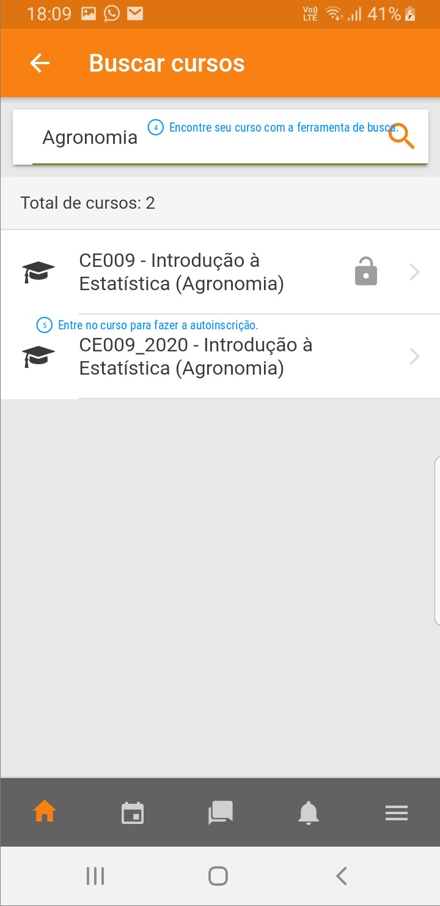
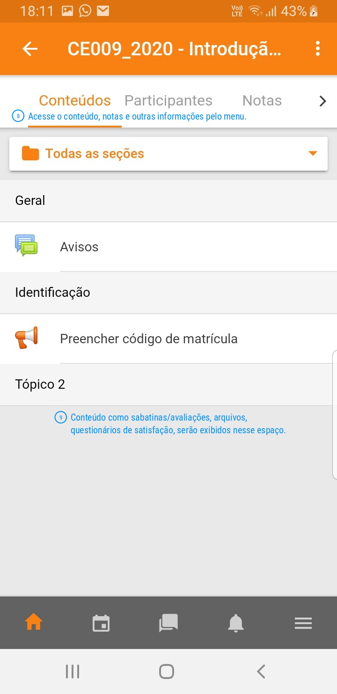

```{r setup, include=FALSE, cache=FALSE}
source("setup_knitr.R")
```

## Página no moodle das turmas

  - [Engenharia de Bioprocessos (F) e Matemática Industrial (MI)](https://moodle.c3sl.ufpr.br/course/view.php?id=293).
  - [Engenharia Ambiental (AMB) e Engenharia Industrial Madeireira (D3p)](https://moodle.c3sl.ufpr.br/course/view.php?id=292).
  - [Engenharia Civil (C)](https://moodle.c3sl.ufpr.br/course/view.php?id=290).
  - [Agronomia (A)](https://moodle.c3sl.ufpr.br/course/view.php?id=291).

Atenção: use o método de autoinscrição para participar do curso. O
código de autoinscrição é <code style="color: orange; font-weight: 800;">estatistica</code>.
Após a inscrição, preencha a informação de código de matrícula.

Para detalhes do cálculo das notas em questões de múltipla escolha no
Moodle, veja [aqui](notas-moodle.html).

## Intruções para usar o moodle

  1. Criar uma conta no serviço moodle disponível em <https://moodle.c3sl.ufpr.br>.
  2. Após criar a conta, procure usando a barra de busca pelo seu
     curso. Por exemplo, busque com "Agronomia". Ao encontrar, faça a
     autoinscrição usando a o código mencionado na seção acima.
  3. Após se inscriver no curso, ficarão visíveis as atividades da
     disciplina.

As imagens abaixo ilustram o uso do aplicativo moodle para celular.

<style type="text/css">
.tg .tg-cly1{ text-align: center; vertical-align: middle }
.tg img { width: 90%; margin: 3px; }
</style>

<table class="tg">
<tr>
<td class="tg-cly1">

</td>
<td class="tg-cly1">

</td>
</tr>
<td class="tg-cly1">

</td>
<td class="tg-cly1">

</td>
<tr>
</tr>
<td class="tg-cly1">

</td>
<td class="tg-cly1">
</td>
<tr>
</table>
